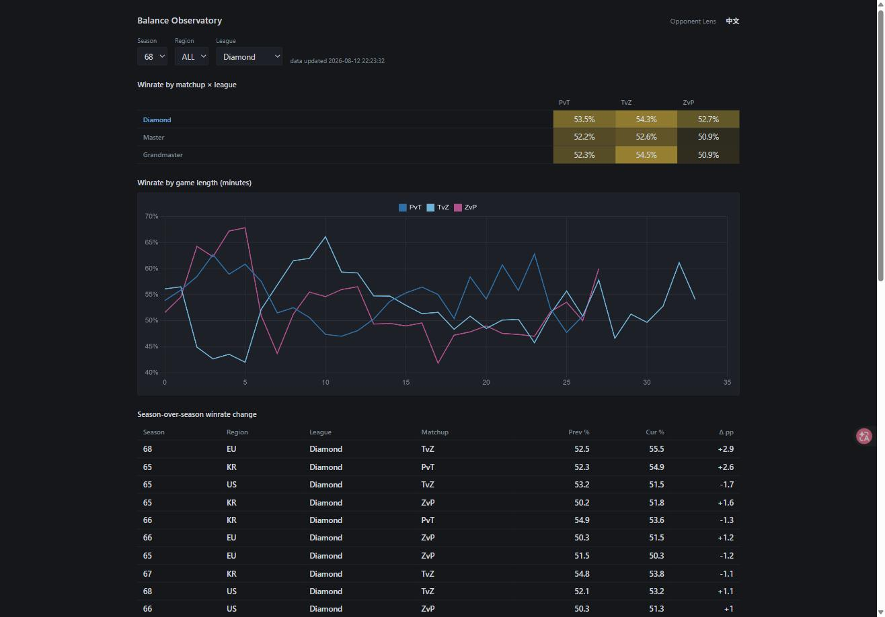
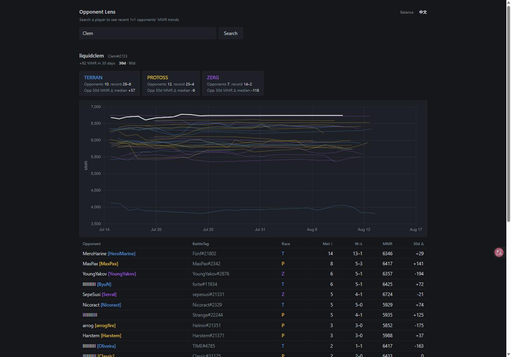
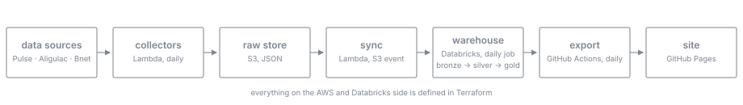

# SC2 Balance Observatory

[中文](README.zh-CN.md)

Collects StarCraft II ladder and pro-match data every day, models it in a warehouse, and publishes the results as two static pages. Covers Diamond league and above.

**Live:** [Balance dashboard](https://jin-shikai.github.io/sc2-balance-observatory/balance.html) · [Opponent Lens](https://jin-shikai.github.io/sc2-balance-observatory/)

Stack: AWS Lambda · S3 · EventBridge · Terraform · Databricks · GitHub Actions · Chart.js

## The pages

### Balance dashboard



Four views, with season / region / league filters and an EN–中文 toggle:

- Winrate heatmap by matchup and league. Each cell is the first race's winrate; blue means below 50%, gold above.
- Winrate by game length. Frames from SC2 Pulse bucket each game by the minute it ended, so the lines show how balance shifts from early to late game.
- Season-over-season winrate change, sortable, with the season's balance patches on hover. Bold rows pass a two-proportion z-test.
- Pro winrate change in the 28 days before vs after each balance patch (Aligulac matches). Solid bars are statistically significant.

### Opponent Lens



Search any player and see their last 100 ranked 1v1 games from the opponents' side: opponents grouped by race with the head-to-head record, each opponent's MMR history over the past 30 or 90 days, and the searched player's own line in white. Click a line to compare just those two players; click an opponent's name to jump to them. The page calls the SC2 Pulse API directly from the browser, so it has no backend and is always current.

## Findings so far

- After patch 5.0.16, Zerg's winrate against Protoss rose in 8 of 9 region × league slices on the ladder (+0.5 to +1.3 pp), and by +8.4 pp in pro matches over the following 28 days.
- Balance depends on game length. In season 68, Terran vs Zerg sits near 40% in games decided before minute 5, then climbs past 55% in the mid game (Diamond+, all regions).
- The official KR Battle.net API returns stale league counts: it disagrees with an independent full ladder scan by more than 100%, while EU and US agree within 1–5%.

## How it works



**Collection.** Five Lambda functions written in Python with no third-party dependencies. EventBridge triggers the two collectors daily. They pull from SC2 Pulse (request rate adapts to the `RateLimit-*` response headers), Aligulac (incremental by match date), and the Battle.net API (OAuth client credentials), and write raw JSON to S3, partitioned by source, endpoint and date.

**Sync.** Databricks Free Edition cannot read S3 directly, so an S3 object-created event triggers a Lambda that copies each new file into a Databricks volume through the Files API. New data reaches the warehouse seconds after it lands.

**Warehouse.** Three SQL layers on Databricks, run daily as a job that reads the SQL files straight from this repo. Bronze loads raw JSON as `VARIANT` with `COPY INTO`, which skips files it has already seen. Silver parses it into 11 tables and handles the real-world mess: duplicate snapshots, games-played counters that reset when a player changes division, race parsed out of team identifiers, entities stitched across seasons. Gold builds 7 analysis tables: winrates with Wilson intervals, season deltas tested with a two-proportion z-test and annotated with that season's patches, a ±28-day pro event study around each balance patch, per-map attribution, race-switching flows, and population trends.

**Publish.** A GitHub Actions job queries the gold tables through the SQL Statement API each morning, writes the results as JSON into `web/data/`, commits, and deploys GitHub Pages. Both pages are single HTML files rendered with Chart.js.

**Infrastructure.** Terraform defines the AWS and Databricks side in three modules (storage, ingestion, databricks), with remote state in S3. CI runs ruff, pytest and `terraform validate` on every push. AWS costs about $1 a month; Databricks and GitHub stay on free tiers.

## Repository layout

```
infra/            Terraform modules
ingestion/        Python collectors (Lambda)
databricks/sql/   bronze / silver / gold
web/              the two pages + exported data
scripts/          data export and sync helpers
.github/          CI, Pages deploy, daily data refresh
```

## Data

Ladder data from [SC2 Pulse](https://sc2pulse.nephest.com/sc2/), pro results from [Aligulac](https://aligulac.com/), official league counts from the Battle.net API (used to reconcile the pipeline: population counts matched within 1–5% for EU/US). All data is used non-commercially with credit. Not affiliated with Blizzard Entertainment.
